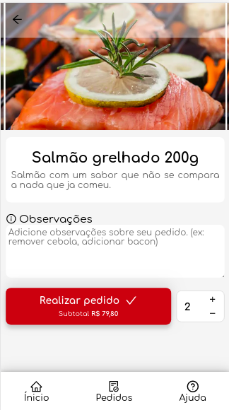

# Smart Menu

> Make your sales more faster and intelligent

Smart Menu is a complete platform to manage and control your sales and to make the attendance process more fluid and faster, using the powerful of technology.


## Installation

```sh
  ~ git clone https://github.com/RaphaelOliveiraMoura/smart-menu.git
```

**Preparing environment**

The fastier mode to run the application is with [docker compose](https://docs.docker.com/compose/), but before of all you need to configurate the _.env_ file present in _\<root\>/backend_ folder.

You can follow the _.env.example_ structure to define the values of your environment.

Then, after that you just need to run the follow command:

```sh
  ~ docker-compose --env-file=./backend/.env up
```

## Usage example

<div style="text-align:center">
  
  
  
  
  
  
</div>

## Development setup

...

## Architecture and Technologies

For this project was used some SOLID and DDD concepts very important to improve the software sacalibility and maintainability.

In the backend was used Typescript to give more powers adding types and to make more easier understand the data structure in all parts of the code.

Was used Docker and DockerCompose to make the deployment process more simple, and to be easier start the project without any external dependences, just docker.


